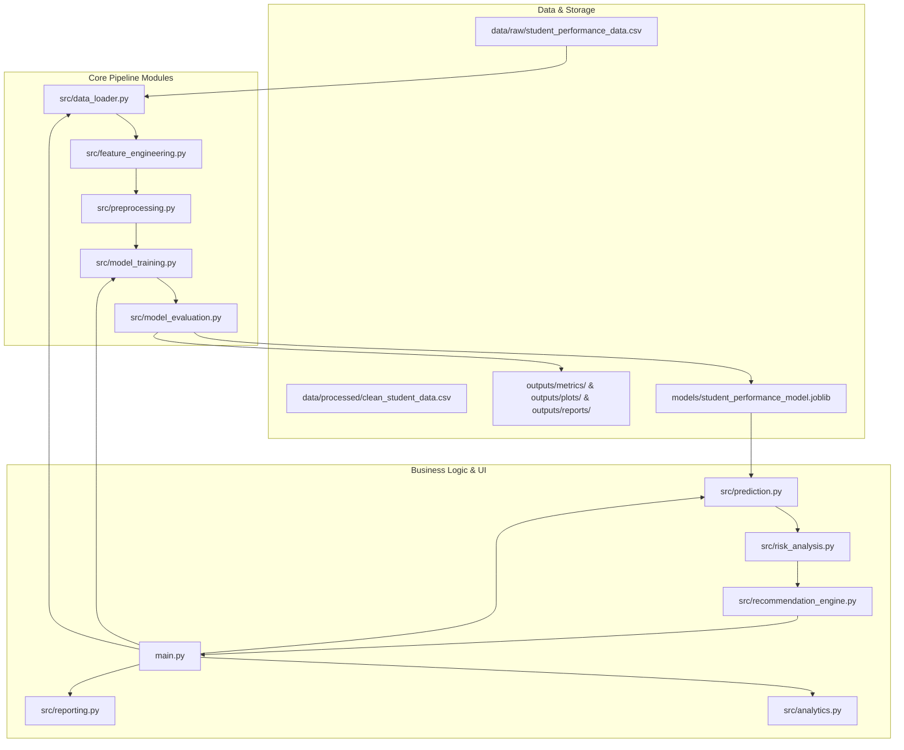

# VITyarthi – Fundamentals of AI and ML
# Course Project Plan: Student Performance Prediction System Using Machine Learning

## 1. Problem Definition
Academic underperformance often goes undetected until summative final examinations, by which point opportunities for timely educational interventions have passed. Educational institutions accumulate significant quantities of formative data—including lecture attendance, assignment completion, midterm assessment marks, study commitments, and engagement levels. However, these data points frequently remain siloed and underutilized.

The **Student Performance Prediction System** addresses this challenge by providing an end-to-end Machine Learning pipeline that forecasts a student's final academic examination score from multidimensional engagement and academic indicators, categorizes the student into clear performance tiers, and automatically surfaces actionable, rule-based academic advisory recommendations.

---

## 2. Objectives
1. **Accurate Regression Modeling**: Develop, benchmark, and validate multiple regression algorithms (Linear Regression, Decision Tree Regressor, Random Forest Regressor, Gradient Boosting Regressor) using 5-fold cross-validation.
2. **Leakage-Free Feature Processing**: Build a scikit-learn `Pipeline` and `ColumnTransformer` architecture ensuring zero data leakage between training and testing splits.
3. **Transparent Performance Tiers**: Map continuous score predictions to well-defined, documented academic performance bands (Excellent, Good, Average, Needs Improvement).
4. **Actionable Advisory Recommendations**: Implement an interpretable, rule-based recommendation engine that translates feature deficits (e.g., low attendance or insufficient study hours) into constructive student feedback.
5. **Interactive & Robust CLI Application**: Provide a resilient, menu-driven command-line interface with strict input validation and defensive error handling.
6. **Academic Reproducibility & Rigor**: Guarantee 100% reproducible results with fixed random states and authentic metrics derived exclusively from runtime execution.

---

## 3. Project Scope

### In-Scope
- Ingestion of student academic and behavioral indicators via CSV datasets and interactive CLI inputs.
- Robust data cleaning: handling of missing values via median and modal imputation.
- Domain-specific feature engineering (Academic Engagement Index, Assessment Momentum, Study Efficiency Ratio).
- Comparative evaluation of multiple regression algorithms across standard academic metrics (MAE, MSE, RMSE, R²).
- Model persistence using Joblib for on-demand inference without retraining.
- Feature importance and residual analytics saved as high-resolution plots.
- Comprehensive unit and integration test suite using Pytest.

### Out-of-Scope
- Complex deep neural networks (unnecessary for tabular educational datasets of this scale and detrimental to interpretability).
- External cloud or LLM API integrations (strictly offline, self-contained classical ML implementation).
- Heavy database backends (flat CSV and Joblib storage chosen for simplicity and zero-configuration academic evaluation).

---

## 4. Requirements Specification

### 4.1 Functional Requirements
- **FR-1: Data Ingestion & Validation**: Ingest student data from CSV, validate schema, verify numerical ranges (e.g., attendance in [0, 100], scores in [0, 100]), and isolate target variables.
- **FR-2: Preprocessing & Feature Engineering**: Apply median imputation for numerical features, modal imputation for categorical features, standard scaling, and one-hot encoding without data leakage.
- **FR-3: Model Training & Comparison**: Train at least three regression algorithms with 5-fold cross-validation, track training/testing metrics, and select the optimal model based on R² and RMSE.
- **FR-4: Model Persistence & Loading**: Serialize the fitted pipeline to disk using Joblib; load the saved model without requiring retraining.
- **FR-5: Interactive Prediction & Input Validation**: Accept user inputs via CLI, validate against physical bounds, execute model inference, and output continuous predicted scores.
- **FR-6: Risk Categorization & Advisory**: Categorize predicted scores into project-defined performance tiers and output transparent, rule-based recommendations.
- **FR-7: Analytics & Visualization**: Generate and save feature importance plots, correlation matrices, and residual distribution charts.
- **FR-8: Structured Reporting**: Output summary reports in Markdown and JSON formats detailing dataset parameters, cross-validation metrics, and final model attributes.

### 4.2 Non-Functional Requirements
- **NFR-1: Performance**: Model inference latency < 50 milliseconds once loaded.
- **NFR-2: Reliability & Fault Tolerance**: Defensive try-catch blocks and input guards preventing application crashes on corrupted data or out-of-range inputs.
- **NFR-3: Usability**: Clear text-based menu interface with immediate feedback, progress indicators, and readable tables.
- **NFR-4: Maintainability**: Modular package structure adhering to PEP 8 standards with comprehensive docstrings and type hints.
- **NFR-5: Reproducibility**: Deterministic execution across all modeling steps achieved via fixed seeds (`random_state=42`).
- **NFR-6: Resource Efficiency**: Model size < 25 MB, zero external network dependency during evaluation, minimal RAM footprint (< 500 MB).

---

## 5. System Architecture & Module Responsibilities

### Module Responsibilities
1. `src/data_loader.py`: Dataset loading, schema validation, column verification, and 80/20 train/test splitting.
2. `src/feature_engineering.py`: Computes derived academic indicators (Engagement Index, Assessment Momentum, Study Efficiency).
3. `src/preprocessing.py`: Configures `ColumnTransformer` with `SimpleImputer`, `StandardScaler`, and `OneHotEncoder`.
4. `src/model_training.py`: Instantiates regression models, executes 5-fold cross-validation, fits on training split, and saves final pipeline.
5. `src/model_evaluation.py`: Computes test set metrics (MAE, MSE, RMSE, R²), produces formatted comparison tables, and serializes metrics.
6. `src/prediction.py`: Loads persisted Joblib model, validates single-instance inputs, and outputs predicted scores.
7. `src/risk_analysis.py`: Maps scores to project-defined performance tiers (Excellent, Good, Average, Needs Improvement).
8. `src/recommendation_engine.py`: Evaluates input feature values against academic thresholds to provide rule-based recommendations.
9. `src/analytics.py`: Computes feature importances and exports visualization figures to `outputs/plots/`.
10. `src/reporting.py`: Generates comprehensive project summary reports in Markdown and JSON.
11. `src/utils.py`: Common directory initialization, logging configuration, and console formatting.
12. `main.py`: Interactive CLI entry point coordinating the user workflows.

---

## 6. Development Phases & Roadmap

| Phase | Milestone Description | Deliverables |
|:-----:|:----------------------|:-------------|
| **Phase 1** | Architecture & Requirements | `PROJECT_PLAN.md`, `statement.md`, directory structure, git setup |
| **Phase 2** | Dataset Decision & Ingestion | `data/raw/student_performance_data.csv`, `DATASET.md`, `notebooks/exploratory_analysis.ipynb` |
| **Phase 3** | Preprocessing & Engineering | `src/data_loader.py`, `src/feature_engineering.py`, `src/preprocessing.py` |
| **Phase 4** | Model Training & Evaluation | `src/model_training.py`, `src/model_evaluation.py`, `models/`, `outputs/metrics/` |
| **Phase 5** | Inference & Advisory | `src/prediction.py`, `src/risk_analysis.py`, `src/recommendation_engine.py` |
| **Phase 6** | Analytics & Reporting | `src/analytics.py`, `src/reporting.py`, `outputs/plots/`, `outputs/reports/` |
| **Phase 7** | CLI Integration | `main.py` with 6-option menu and robust error handling |
| **Phase 8** | Testing Suite | `tests/test_*.py` using Pytest with edge cases and input validation checks |
| **Phase 9** | Documentation & Diagrams | `docs/`, `README.md` (26 sections), `VITYARTHI_COMPLIANCE.md` |
| **Phase 10** | End-to-End Verification | Full execution audit, metric validation, final score assessment |

---

## 7. Testing Strategy
Testing will be performed using `pytest`:
- **Unit Tests**:
  - `tests/test_data_loader.py`: File presence, non-empty DataFrame, correct column headers, 80/20 train/test split size, missing file exception handling.
  - `tests/test_preprocessing.py`: Imputation of NaNs, transformation shape, absence of data leakage (transformers fit only on train).
  - `tests/test_model.py`: Model fitting, cross-validation metrics, non-empty predictions, metric computation correctness, Joblib serialization and deserialization.
  - `tests/test_prediction.py`: Valid prediction range [0, 100], out-of-range input validation errors, negative study hours rejection, missing field handling.
  - `tests/test_recommendations.py`: Correct performance band mapping and triggered recommendations.
- **System / Integration Tests**:
  - Full pipeline execution from data loading through preprocessing, training, evaluation, and reporting without runtime exceptions.

---

## 8. Documentation Strategy
- `README.md`: Complete 26-section guide following VITyarthi guidelines.
- `DATASET.md`: In-depth dataset profiling, source documentation, feature dictionary, and ethical limitations.
- `statement.md`: Problem statement, scope, target users, and expected outcomes.
- `docs/`: Dedicated markdown files with Mermaid diagrams for Architecture, Workflow, Use Cases, Sequence, Component/Classes, and Storage Justification.
- `VITYARTHI_COMPLIANCE.md`: Granular compliance matrix verifying every item against project deliverables.
