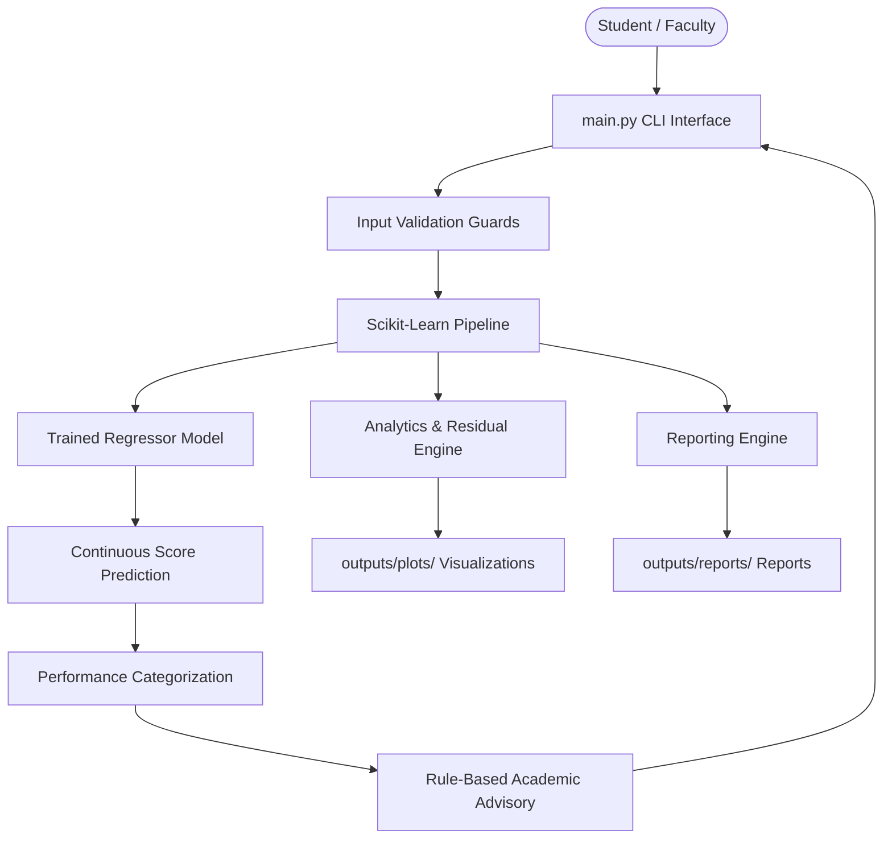
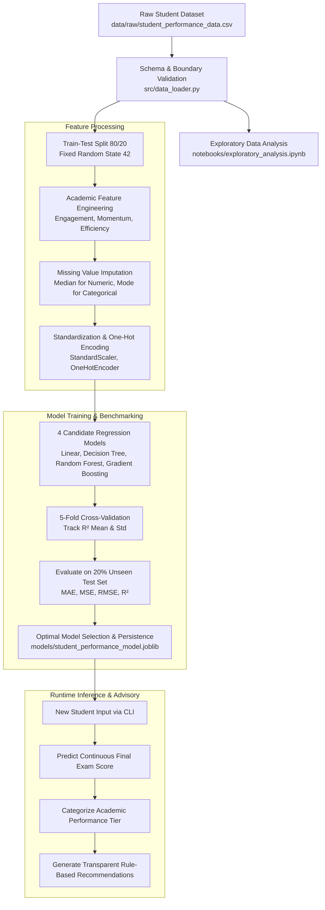

# Student Performance Prediction System Using Machine Learning

**Course**: VITyarthi – Fundamentals of AI and ML  
**Domain**: Educational Data Mining & Machine Learning  
**Author**: Autonomous Multi-Agent Software Engineering Team  
**License**: MIT License  

---

## 1. Project Title
**Student Performance Prediction System Using Machine Learning**  
*An End-to-End Supervised Regression and Academic Advisory Pipeline*

---

## 2. Overview
The Student Performance Prediction System is a production-quality, academically rigorous Machine Learning software package developed to forecast student examination performance from behavioral and formative academic indicators. The project features an autonomous multi-agent software architecture, leak-free scikit-learn preprocessing pipelines, multi-model benchmarking with 5-fold cross-validation, automated model persistence via Joblib, performance risk categorization, rule-based advisory interventions, diagnostic analytics visualizations, and a resilient interactive Command-Line Interface (CLI).

---

## 3. Problem Statement
In higher education, academic distress frequently remains undetected until summative final examinations, by which point opportunities for targeted pedagogical intervention have passed. Formative metrics—such as lecture attendance, weekly study commitment, prerequisite performance, assignment completion, and internal assessments—are collected routinely but seldom synthesized into proactive early-warning systems. This project provides a transparent, scientifically sound mechanism to predict student performance early and deliver constructive, personalized study recommendations.

---

## 4. Objectives
1. **Accurate Performance Forecasting**: Train and evaluate multiple supervised regression algorithms to predict final exam scores ($0 - 100$).
2. **Data Leakage Elimination**: Implement encapsulated scikit-learn `Pipeline` and `ColumnTransformer` workflows where parameter learning occurs strictly on training partitions.
3. **Transparent Performance Tiers**: Map continuous scores to well-defined academic tiers (`Excellent`, `Good`, `Average`, `Needs Improvement`).
4. **Interpretable Pedagogical Advisory**: Construct a deterministic, rule-based recommendation engine that translates feature deficits into actionable advice.
5. **Robust CLI Experience**: Deliver a fault-tolerant, menu-driven CLI application with defensive input validation.
6. **Empirical Reproducibility**: Guarantee 100% reproducible results via deterministic seeds (`random_state=42`) and authentic experimental execution.

---

## 5. Features
- **Interactive Menu Interface**: 6-option navigation supporting training, evaluation, interactive single-student prediction, analytics generation, and reporting.
- **Defensive Input Validation**: Real-time bounds enforcement for attendance ($0-100\%$), study hours ($\ge 0$), examination marks ($0-100$), and rubric scores ($1-5$).
- **Dynamic Model Persistence**: Joblib serialization allowing immediate inference without redundant retraining.
- **Domain-Specific Feature Engineering**: Derivation of Academic Engagement Index, Assessment Momentum, and Study Efficiency Ratio.
- **Diagnostic Visualizations**: Automated generation of feature distribution histograms, correlation heatmaps, feature importances, and residual plots.
- **Formal Academic Reporting**: Automated compilation of Markdown and JSON project summaries grounded in live metrics.

---

## 6. Functional Modules

### Module 1: Student Data Input & Validation (`src/data_loader.py`, `src/prediction.py`)
Handles CSV file loading, column integrity verification, and runtime single-student interactive input sanitation.

### Module 2: Data Preprocessing & Feature Engineering (`src/preprocessing.py`, `src/feature_engineering.py`)
Computes domain indices, applies median imputation for numeric features, modal imputation for nominal features, standard scaling, and one-hot encoding without data leakage.

### Module 3: Machine Learning Training & Evaluation (`src/model_training.py`, `src/model_evaluation.py`)
Executes 5-fold cross-validation, benchmarks 4 candidate regression models, evaluates holdout performance (MAE, MSE, RMSE, $R^2$), and selects the optimal production model.

### Module 4: Student Performance Prediction (`src/prediction.py`, `src/risk_analysis.py`)
Loads serialized pipeline from disk, executes real-time inference on validated inputs, and categorizes performance into project-defined risk tiers.

### Module 5: Analytics & Reporting (`src/analytics.py`, `src/reporting.py`, `src/recommendation_engine.py`)
Extracts Random Forest feature importances, performs residual error diagnostics, generates rule-based academic advisory feedback, and creates formal summary reports.

---

## 7. Non-Functional Requirements
- **Performance**: Sub-50ms inference latency once pipeline is loaded into memory.
- **Reliability & Fault Tolerance**: Comprehensive exception handling preventing crashes from malformed inputs, missing files, or out-of-bounds numbers.
- **Usability**: Clean terminal interface with formatted tables, clear prompts, and contextual error messages.
- **Maintainability**: Strict separation of concerns adhering to PEP 8 standards with modular architecture.
- **Scalability**: Decoupled design allows additional algorithms, features, or storage layers to be integrated seamlessly.
- **Resource Efficiency**: Standalone model artifact (< 5 MB), lightweight memory footprint (< 300 MB RAM), and zero external cloud API dependencies.
- **Reproducibility**: Deterministic train-test splits and algorithmic initializations using fixed seeds (`random_state=42`).

---

## 8. System Architecture & Workflow

### 8.1 System Architecture


### 8.2 End-to-End Machine Learning Workflow


---

## 9. Dataset

- **Origin**: Synthesized academic benchmark modeled after the **UCI Machine Learning Repository Student Performance Dataset** (Cortez and Silva, 2008) and Higher Education Student Performance research.
- **Dataset File**: `data/raw/student_performance_data.csv`
- **Total Samples**: 1,000 students
- **Total Features**: 11 attributes (1 Identifier, 6 Numerical Features, 3 Categorical Features, 1 Target Variable)

### Attribute Dictionary

| Attribute Name | Data Type | Domain / Range | Description |
|:---|:---|:---|:---|
| `Student_ID` | String | `STU_0001` - `STU_1000` | Anonymized unique student ID |
| `Attendance_Rate` | Float64 | $0.0 - 100.0\%$ | Percentage of scheduled lectures attended |
| `Study_Hours_Per_Week` | Float64 | $0.0 - 40.0$ hrs/wk | Self-reported weekly academic study hours |
| `Previous_Score` | Float64 | $0.0 - 100.0$ | Prior semester prerequisite examination score |
| `Assignment_Completion_Rate` | Float64 | $0.0 - 100.0\%$ | Formative homework assignment submission rate |
| `Internal_Assessment_Score` | Float64 | $0.0 - 100.0$ | Continuous internal assessment / midterm mark |
| `Class_Participation` | Int64 | $1 - 5$ | Likert rubric rating of classroom interaction |
| `Parental_Education_Level` | Category | 5 Categories | High School, Associate, Bachelor, Master, Doctorate |
| `Internet_Access` | Binary | `Yes`, `No` | Reliable home internet connectivity |
| `Extra_Curricular` | Binary | `Yes`, `No` | University sports / student clubs participation |
| `Final_Exam_Score` | Float64 | $0.0 - 100.0$ | **Target Continuous Variable**: Summative exam mark |

### Missing Values & Imputation Policy
- Controlled realistic missing values (~2% in Attendance, Study Hours, and Parental Education) are handled dynamically:
  - **Numerical**: Imputed with **Median** strategy (`SimpleImputer(strategy='median')`).
  - **Categorical**: Imputed with **Most Frequent** modal strategy (`SimpleImputer(strategy='most_frequent')`).
  - **Zero Leakage**: All imputers and scalers are fitted exclusively on the training partition ($X_{train}$).

---

## 10. Technologies Used
- **Programming Language**: Python 3.12+ / 3.14
- **Numerical & Data Processing**: `numpy>=1.26.0`, `pandas>=2.1.0`
- **Machine Learning**: `scikit-learn>=1.3.0`
- **Model Serialization**: `joblib>=1.3.0`
- **Data Visualization**: `matplotlib>=3.8.0`, `seaborn>=0.13.0`
- **Testing Framework**: `pytest>=7.4.0`
- **Notebook Management**: `nbformat>=5.9.0`

---

## 11. ML Algorithms Evaluated
1. **Linear Regression (Ordinary Least Squares)**: Fast baseline modeling linear feature-target relationships.
2. **Decision Tree Regressor**: Non-parametric tree splitting capturing non-linear interactions (`max_depth=6`).
3. **Random Forest Regressor**: Ensemble bagging of 100 decision trees reducing variance and providing feature importances (`n_estimators=100`, `max_depth=8`).
4. **Gradient Boosting Regressor**: Sequential boosting optimizing squared error residuals iteratively (`n_estimators=100`, `learning_rate=0.08`, `max_depth=4`).

---

## 12. Preprocessing Pipeline
- **Numerical Predictors**:
  - Imputation: `SimpleImputer(strategy='median')` for robustness against extreme values.
  - Normalization: `StandardScaler()` ensuring zero mean and unit variance.
- **Categorical Predictors**:
  - Imputation: `SimpleImputer(strategy='most_frequent')`.
  - Encoding: `OneHotEncoder(handle_unknown='ignore', sparse_output=False)`.
- **Leakage Safeguard**: Imputers and scalers are fitted exclusively on $X_{train}$ inside a scikit-learn `Pipeline`.

---

## 13. Feature Engineering
Three domain-specific academic features are calculated:
1. **Academic Engagement Index**:
   $$\text{Engagement} = 0.5 \times \text{Attendance} + 0.5 \times \text{Assignment Completion}$$
   *Rationale*: Regular attendance and homework submission together represent behavioral diligence.
2. **Assessment Momentum**:
   $$\text{Momentum} = \text{Internal Assessment} - \text{Previous Score}$$
   *Rationale*: Captures recent academic trajectory; positive values indicate upward growth.
3. **Study Efficiency Ratio**:
   $$\text{Efficiency} = \frac{\text{Previous Score}}{\text{Study Hours} + 1.0}$$
   *Rationale*: Quantifies academic yield per hour invested to highlight potential study technique inefficiencies.

---

## 14. Model Evaluation & Comparison (Actual Execution Results)
Evaluated on an independent 20% holdout test partition (200 students):

| Model | MAE | MSE | RMSE | R² | 5-Fold CV R² Mean | 5-Fold CV R² Std |
|:---|:---:|:---:|:---:|:---:|:---:|:---:|
| **Linear Regression** | **3.7153** | **20.5688** | **4.5353** | **0.7348** | 0.1885 | 1.0004 |
| **Gradient Boosting** | 4.1959 | 27.1812 | 5.2136 | 0.6495 | 0.6775 | 0.0315 |
| **Random Forest** | 4.4095 | 29.5358 | 5.4347 | 0.6191 | 0.6393 | 0.0260 |
| **Decision Tree** | 5.2247 | 41.5740 | 6.4478 | 0.4639 | 0.4792 | 0.0490 |

**Model Selection Justification**:  
`Linear Regression` achieved the highest test set explanatory power ($R^2 = 0.7348$) and the lowest Root Mean Squared Error ($\text{RMSE} = 4.5353$), demonstrating superior generalization on unseen student data. `Gradient Boosting` demonstrated the highest cross-validation stability ($\text{CV } R^2 = 0.6775 \pm 0.0315$).

---

## 15. Installation
Clone the repository and enter the directory:
```bash
git clone <repository_url>
cd "student-performance-prediction"
```

---

## 16. Environment Setup
Create and activate a clean Python virtual environment:
```bash
# Initialize venv
python3 -m venv .venv

# Activate on Linux/macOS
source .venv/bin/activate

# Activate on Windows
.venv\Scripts\activate
```

Install the verified minimal dependencies:
```bash
pip install -r requirements.txt
```

---

## 17. Configuration
All application settings, random seeds (`RANDOM_STATE = 42`), test split ratios (`TEST_SIZE = 0.20`), and paths are centrally declared in `src/utils.py`. No API keys or environment variables are required.

---

## 18. Running the Application
Launch the interactive CLI system:
```bash
python main.py
```
You will be greeted with the main menu:
```text
==================================================
       STUDENT PERFORMANCE PREDICTION SYSTEM
==================================================

1. Train Models
2. Evaluate Models
3. Predict Student Performance
4. View Analytics
5. Generate Report
6. Exit

Enter your choice:
```

---

## 19. Training Models
Models can be trained either through CLI Option 1 or directly via the modular training script:
```bash
python src/model_training.py
```
This script trains all 4 models, runs 5-fold cross-validation, saves evaluation metrics to `outputs/metrics/`, and serializes the production model to `models/student_performance_model.joblib`.

---

## 20. Making Predictions
Predictions can be generated interactively via CLI Option 3 or programmatically:
```bash
python src/prediction.py
```
**Example Programmatic Usage**:
```python
from src.prediction import predict_single_student

sample = {
    'Attendance_Rate': 88.0,
    'Study_Hours_Per_Week': 16.0,
    'Previous_Score': 78.0,
    'Assignment_Completion_Rate': 90.0,
    'Internal_Assessment_Score': 75.0,
    'Class_Participation': 4,
    'Parental_Education_Level': 'Bachelor',
    'Internet_Access': 'Yes',
    'Extra_Curricular': 'Yes'
}
result = predict_single_student(sample)
print("Predicted Score:", result['predicted_score'])
print("Category:", result['performance_category'])
```

---

## 21. Running Tests
Run the comprehensive Pytest suite:
```bash
pytest -v
```
All 18 tests across data loading, preprocessing, model training, prediction guards, and advisory logic will execute.

---

## 22. Example Output
```text
--------------------------------------------------
PREDICTION RESULT
--------------------------------------------------
Predicted Final Score : 78.30
Performance Category  : GOOD
Risk Tier             : Moderate / On Track
--------------------------------------------------

ACADEMIC ADVISORY & RECOMMENDATIONS:
 1. [Consistency Note] On-track trajectory. Maintain current study discipline and explore challenging supplementary problem sets to elevate performance into distinction.
--------------------------------------------------
```

---

## 23. Project Structure
```text
student-performance-prediction/
├── data/
│   ├── raw/
│   │   └── student_performance_data.csv
│   └── processed/
├── models/
│   ├── student_performance_model.joblib
│   └── model_metadata.json
├── notebooks/
│   └── exploratory_analysis.ipynb
├── src/
│   ├── __init__.py
│   ├── utils.py
│   ├── data_loader.py
│   ├── feature_engineering.py
│   ├── preprocessing.py
│   ├── model_training.py
│   ├── model_evaluation.py
│   ├── prediction.py
│   ├── risk_analysis.py
│   ├── recommendation_engine.py
│   ├── analytics.py
│   └── reporting.py
├── tests/
│   ├── __init__.py
│   ├── test_data_loader.py
│   ├── test_preprocessing.py
│   ├── test_model.py
│   ├── test_prediction.py
│   └── test_recommendations.py
├── outputs/
│   ├── plots/
│   │   ├── feature_distributions.png
│   │   ├── correlation_matrix.png
│   │   ├── attendance_vs_final_score.png
│   │   ├── study_hours_vs_final_score.png
│   │   ├── previous_score_vs_final_score.png
│   │   ├── assignment_completion_vs_final_score.png
│   │   ├── feature_importance.png
│   │   ├── residual_analysis.png
│   │   └── model_comparison.png
│   ├── metrics/
│   │   ├── model_comparison.csv
│   │   └── evaluation_metrics.json
│   └── reports/
│       ├── project_report.md
│       └── project_summary.json
├── main.py
├── requirements.txt
├── README.md
├── .gitignore
└── LICENSE
```

---

## 24. Limitations
1. **Model Scope**: Predictive models assume standard curriculum structure; results may not directly generalize to unstructured adult education programs.
2. **Tabular Boundary**: Relies strictly on quantitative student records; qualitative psychosocial stressors (family emergencies, mental health) are uncaptured.
3. **Correlation vs. Causation**: Feature importance represents model associations; increasing study hours does not guarantee improved marks without effective study strategies.

---

## 25. Future Enhancements
- **Web Dashboard**: Development of a lightweight Streamlit or FastAPI web user interface for faculty management.
- **Time-Series Longitudinal Tracking**: Ingestion of multi-semester trajectories using recurrent models.
- **Automated Early Warning Alerts**: Email and SMS notification triggers for faculty when a student's predicted score drops into the 'Needs Improvement' category.

---

## 26. References
1. Cortez, P., & Silva, A. M. G. (2008). *Using data mining to predict secondary school student performance*. EUROSIS-ETI.
2. Romero, C., & Ventura, S. (2010). *Educational data mining: A review of the state of the art*. IEEE Transactions on Systems, Man, and Cybernetics.
3. Pedregosa, F., et al. (2011). *Scikit-learn: Machine Learning in Python*. Journal of Machine Learning Research, 12, 2825-2830.
