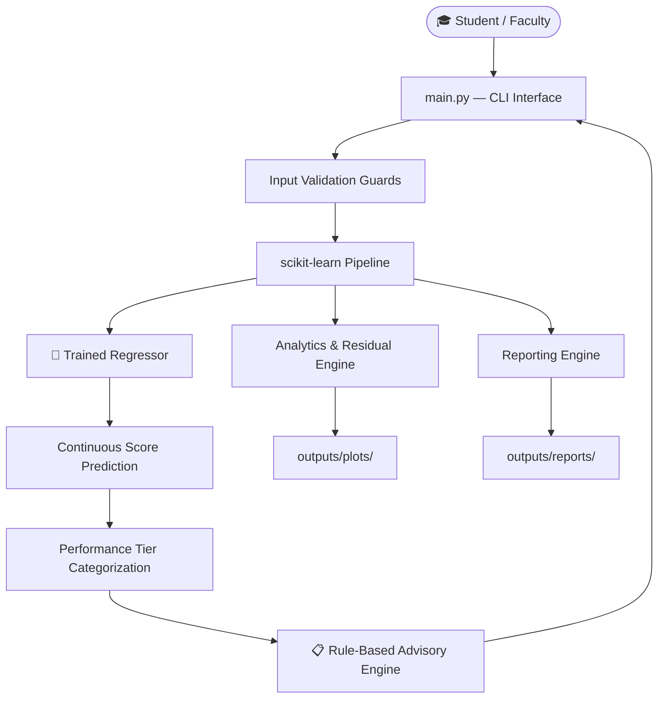

<div align="center">


<br/>


<br/>

> **🎓 Course**: VITyarthi – Fundamentals of AI and ML &nbsp;|&nbsp; **📊 Domain**: Educational Data Mining

</div>

---

## 🚀 What is This?

**Student Performance Prediction System** is a production-grade Machine Learning pipeline that **predicts a student's final exam score** from behavioral and academic indicators — and delivers personalized study recommendations.

No fluff. No cloud APIs. Pure ML, running entirely on your machine.

```
Attendance + Study Hours + Previous Scores + ... → 🤖 ML Model → Predicted Score + Recommendations
```

---

## ✨ Highlights

| Feature | Details |
|:---|:---|
| 🧠 **4 ML Models Benchmarked** | Linear Regression, Decision Tree, Random Forest, Gradient Boosting |
| 🔒 **Zero Data Leakage** | Full `scikit-learn` Pipeline — scalers fit only on training data |
| 📊 **5-Fold Cross-Validation** | Robust generalization across all candidate models |
| 🎯 **R² = 0.7348** | Best model achieves 73.5% variance explanation on unseen test data |
| ⚡ **Sub-50ms Inference** | Real-time predictions once model is loaded |
| 🗂️ **Fully Modular Codebase** | Clean `src/` separation of concerns |
| 🖥️ **Interactive CLI** | Fault-tolerant, menu-driven interface with input validation |
| 📈 **Auto-Generated Analytics** | Correlation heatmaps, feature importances, residual plots |

---

## 📊 Model Performance (Actual Results)

Evaluated on an independent **20% holdout test set (200 students)**:

| 🥇 Rank | Model | MAE ↓ | RMSE ↓ | R² ↑ | CV R² |
|:---:|:---|:---:|:---:|:---:|:---:|
| 🥇 | **Linear Regression** | **3.7153** | **4.5353** | **0.7348** | 0.1885 |
| 🥈 | Gradient Boosting | 4.1959 | 5.2136 | 0.6495 | **0.6775** |
| 🥉 | Random Forest | 4.4095 | 5.4347 | 0.6191 | 0.6393 |
| 4th | Decision Tree | 5.2247 | 6.4478 | 0.4639 | 0.4792 |

> 💡 **Linear Regression** wins on test R² and RMSE. **Gradient Boosting** leads on cross-validation stability (CV R² = 0.6775 ± 0.0315).

---

## 🗂️ Project Structure

```
📦 student-performance-prediction/
├── 📂 data/
│   ├── raw/
│   │   └── student_performance_data.csv   # 1000 students, 11 features
│   └── processed/
├── 📂 models/
│   ├── student_performance_model.joblib   # Serialized production model
│   └── model_metadata.json
├── 📂 notebooks/
│   └── exploratory_analysis.ipynb
├── 📂 src/
│   ├── utils.py                           # Paths, seeds, config
│   ├── data_loader.py                     # CSV ingestion & validation
│   ├── feature_engineering.py             # Domain-specific features
│   ├── preprocessing.py                   # Pipelines (no leakage)
│   ├── model_training.py                  # Train, CV, benchmark
│   ├── model_evaluation.py                # Metrics computation
│   ├── prediction.py                      # Inference engine
│   ├── risk_analysis.py                   # Performance tier mapping
│   ├── recommendation_engine.py           # Rule-based advisory
│   ├── analytics.py                       # Plot generation
│   └── reporting.py                       # MD + JSON reports
├── 📂 tests/                              # 18 Pytest test cases
├── 📂 outputs/
│   ├── plots/                             # 9 diagnostic plots
│   ├── metrics/                           # CSV + JSON metrics
│   └── reports/
├── 🐍 main.py                             # CLI entry point
├── 📄 requirements.txt
└── 📜 LICENSE
```

---

## ⚡ Quick Start

### 1. Clone & Setup

```bash
git clone <repository_url>
cd student-performance-prediction

# Create virtual environment
python3 -m venv .venv

# Activate (macOS/Linux)
source .venv/bin/activate

# Activate (Windows)
.venv\Scripts\activate

# Install dependencies
pip install -r requirements.txt
```

### 2. Run the App

```bash
python main.py
```

```
==================================================
       STUDENT PERFORMANCE PREDICTION SYSTEM
==================================================

1. Train Models
2. Evaluate Models
3. Predict Student Performance
4. View Analytics
5. Generate Report
6. Exit

Enter your choice (1-6):
```

### 3. Run Tests

```bash
pytest -v
```

> ✅ 18 tests across data loading, preprocessing, model training, prediction guards, and advisory logic.

---

## 🧬 Dataset

| Property | Value |
|:---|:---|
| **Source** | Synthetic — modeled on UCI Student Performance Dataset (Cortez & Silva, 2008) |
| **Samples** | 1,000 students |
| **Features** | 11 attributes (6 numerical, 3 categorical, 1 ID, 1 target) |
| **Target** | `Final_Exam_Score` (0–100, continuous) |
| **Missing Data** | ~2% — handled via Pipeline (no leakage) |

### Feature Dictionary

| Feature | Type | Range | Description |
|:---|:---:|:---:|:---|
| `Attendance_Rate` | Float | 0–100% | Lectures attended |
| `Study_Hours_Per_Week` | Float | 0–40 hrs | Weekly self-study |
| `Previous_Score` | Float | 0–100 | Prior semester score |
| `Assignment_Completion_Rate` | Float | 0–100% | Homework submission rate |
| `Internal_Assessment_Score` | Float | 0–100 | Midterm marks |
| `Class_Participation` | Int | 1–5 | Likert scale rating |
| `Parental_Education_Level` | Category | 5 levels | High School → Doctorate |
| `Internet_Access` | Binary | Yes/No | Home connectivity |
| `Extra_Curricular` | Binary | Yes/No | Clubs/sports participation |
| **`Final_Exam_Score`** | **Float** | **0–100** | **🎯 Target variable** |

---

## 🧪 Feature Engineering

Three domain-specific features are derived to boost model signal:

$$\text{Academic Engagement} = 0.5 \times \text{Attendance} + 0.5 \times \text{Assignment Completion}$$

$$\text{Assessment Momentum} = \text{Internal Score} - \text{Previous Score}$$

$$\text{Study Efficiency} = \frac{\text{Previous Score}}{\text{Study Hours} + 1.0}$$

---

## 🏗️ System Architecture



---

## 🔮 Programmatic Usage

```python
from src.prediction import predict_single_student

student = {
    'Attendance_Rate': 88.0,
    'Study_Hours_Per_Week': 16.0,
    'Previous_Score': 78.0,
    'Assignment_Completion_Rate': 90.0,
    'Internal_Assessment_Score': 75.0,
    'Class_Participation': 4,
    'Parental_Education_Level': 'Bachelor',
    'Internet_Access': 'Yes',
    'Extra_Curricular': 'Yes'
}

result = predict_single_student(student)
print(f"Predicted Score : {result['predicted_score']}")
print(f"Category        : {result['performance_category']}")
```

**Output:**
```
--------------------------------------------------
PREDICTION RESULT
--------------------------------------------------
Predicted Final Score : 78.30
Performance Category  : GOOD
Risk Tier             : Moderate / On Track
--------------------------------------------------

ACADEMIC ADVISORY & RECOMMENDATIONS:
 1. [Consistency Note] On-track trajectory. Maintain current study
    discipline and explore supplementary problem sets to push into
    distinction territory.
--------------------------------------------------
```

---

## ⚙️ ML Pipeline (No Leakage Guaranteed)

```
Raw Data → Train/Test Split (80/20)
              ↓
    ┌─── Training Set Only ────────────────────┐
    │  1. Feature Engineering                  │
    │  2. Median Imputer (numeric)             │
    │  3. Mode Imputer (categorical)           │
    │  4. StandardScaler                        │
    │  5. OneHotEncoder                        │
    └──────────────────────────────────────────┘
              ↓
    Fit & Transform on Train → Transform Test Only
              ↓
    4 Models × 5-Fold CV → Best Model Selection
              ↓
    Joblib Serialization → models/student_performance_model.joblib
```

---

## 🔭 Roadmap

- [ ] 🌐 **Web Dashboard** — Streamlit / FastAPI UI for faculty
- [ ] 📅 **Longitudinal Tracking** — Multi-semester recurrent models
- [ ] 🚨 **Early Warning Alerts** — Email/SMS when risk tier drops

---

## 📚 References

1. Cortez, P., & Silva, A. M. G. (2008). *Using data mining to predict secondary school student performance*. EUROSIS-ETI.
2. Romero, C., & Ventura, S. (2010). *Educational data mining: A review of the state of the art*. IEEE Transactions on Systems, Man, and Cybernetics.
3. Pedregosa, F., et al. (2011). *Scikit-learn: Machine Learning in Python*. Journal of Machine Learning Research, 12, 2825–2830.

---

<div align="center">

**Made with ❤️ for VITyarthi – Fundamentals of AI and ML**


</div>
