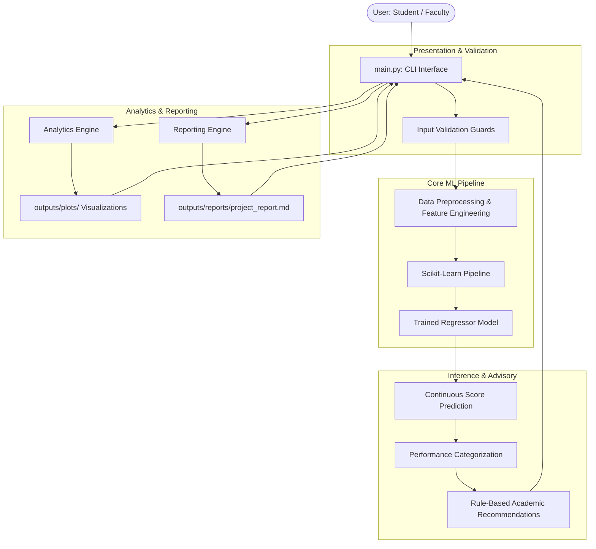

# System Architecture Documentation

## 1. Architectural Overview
The **Student Performance Prediction System** utilizes a decoupled, modular layer architecture designed for academic reproducibility, zero data leakage, and high runtime inference efficiency.

The architecture comprises four core layers:
1. **Presentation & Interaction Layer**: Command-Line Interface (`main.py`) coordinating user workflows and interactive sessions.
2. **Business & Domain Logic Layer**: Input validation guards, performance categorization tiers (`risk_analysis.py`), and rule-based academic intervention guidance (`recommendation_engine.py`).
3. **Machine Learning Pipeline Layer**: Feature engineering (`AcademicFeatureEngineer`), scikit-learn preprocessing `ColumnTransformer`, model cross-validation trainers (`model_training.py`), and metric evaluators (`model_evaluation.py`).
4. **Data & Artifact Storage Layer**: Raw CSV dataset (`data/raw/`), Joblib serialized pipeline model (`models/`), metric summaries (`outputs/metrics/`), diagnostic visualizations (`outputs/plots/`), and structured reports (`outputs/reports/`).

---

## 2. System Architecture Diagram (Mermaid)

---

## 3. Layer Interactions & Invariants
- **Zero Retraining Invariant**: The inference subsystem (`src/prediction.py`) strictly loads the persisted `.joblib` model artifact; it never triggers model fitting during interactive runtime.
- **Leakage Prevention Invariant**: Preprocessing scalers and encoders are fitted exclusively on the 80% training split within an encapsulated `Pipeline`.
- **Fault-Tolerant Boundary**: Out-of-bounds user inputs (such as attendance > 100% or negative study hours) are intercepted and rejected prior to pipeline execution.
