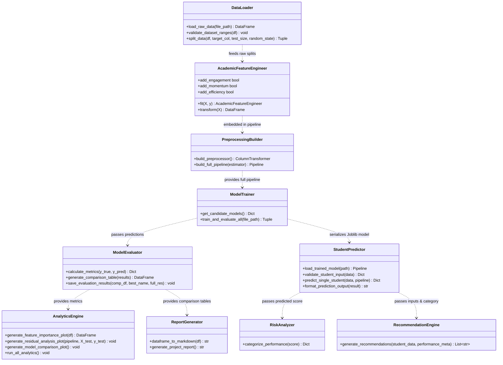

# Component & Class Diagram Documentation

## 1. Architectural Components
The software architecture is modularized into distinct functional components conforming to single-responsibility principles.

---

## 2. Component Diagram (Mermaid)

