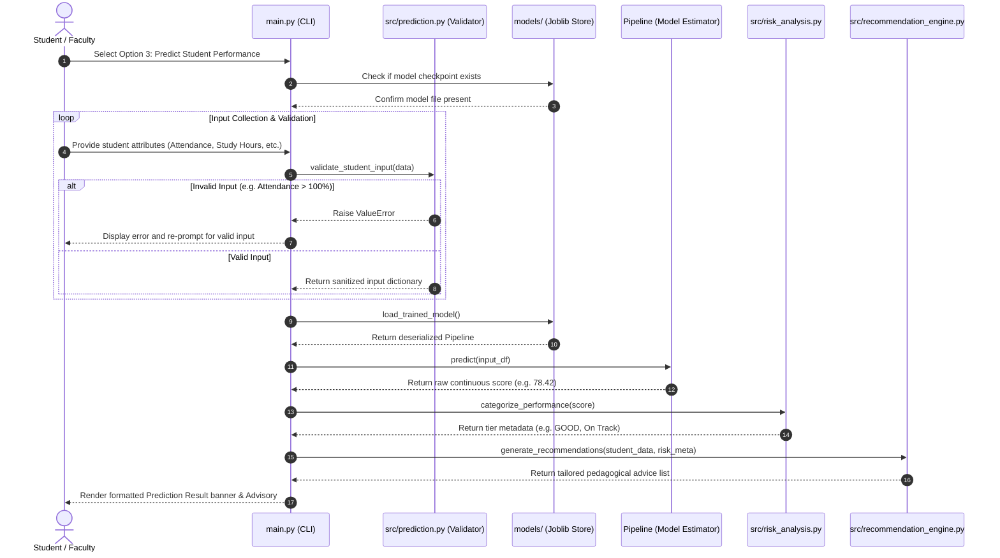

# Sequence Diagram Documentation

## 1. Inference & Advisory Sequence
Illustrates the exact temporal message flow during an interactive student prediction session.

---

## 2. Sequence Diagram (Mermaid)

