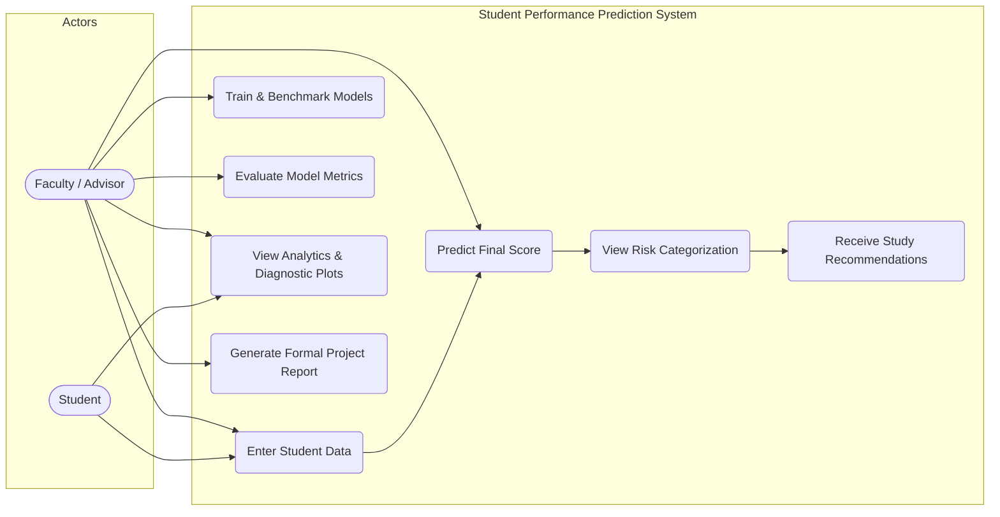

# Use Case Documentation

## 1. System Actors
1. **Student**: Interacts with the system to test academic scenarios, predict expected final examination performance, identify personal risk areas, and receive actionable study habits advice.
2. **Faculty / Academic Advisor**: Reviews cohort benchmarks, executes model retraining, inspects diagnostic feature importances, and evaluates at-risk students to deliver timely remediation.

---

## 2. Use Case Diagram (Mermaid)

---

## 3. Use Case Descriptions

### UC-1: Enter Student Data
- **Primary Actor**: Student, Faculty
- **Preconditions**: Application running in terminal (`python main.py`).
- **Main Flow**: User inputs attendance %, study hours, prior scores, assignment completion, internal assessment mark, participation score, parental education, and binary lifestyle indicators.
- **Exceptions**: Out-of-bounds numerical entries prompt immediate retry messages without crashing.

### UC-2: Predict Final Performance & Receive Advisory
- **Primary Actor**: Student, Faculty
- **Preconditions**: Trained model checkpoint exists at `models/student_performance_model.joblib`.
- **Main Flow**: System passes validated data through the loaded scikit-learn pipeline, outputs continuous predicted score, displays performance tier, and prints targeted recommendations.
- **Exceptions**: If model checkpoint is absent, system prompts user to run training first.

### UC-3: Train & Benchmark Models
- **Primary Actor**: Faculty
- **Preconditions**: Raw dataset present at `data/raw/student_performance_data.csv`.
- **Main Flow**: Trains 4 candidate regression algorithms, executes 5-fold cross-validation, computes test set metrics, selects optimal model, and serializes artifacts.
