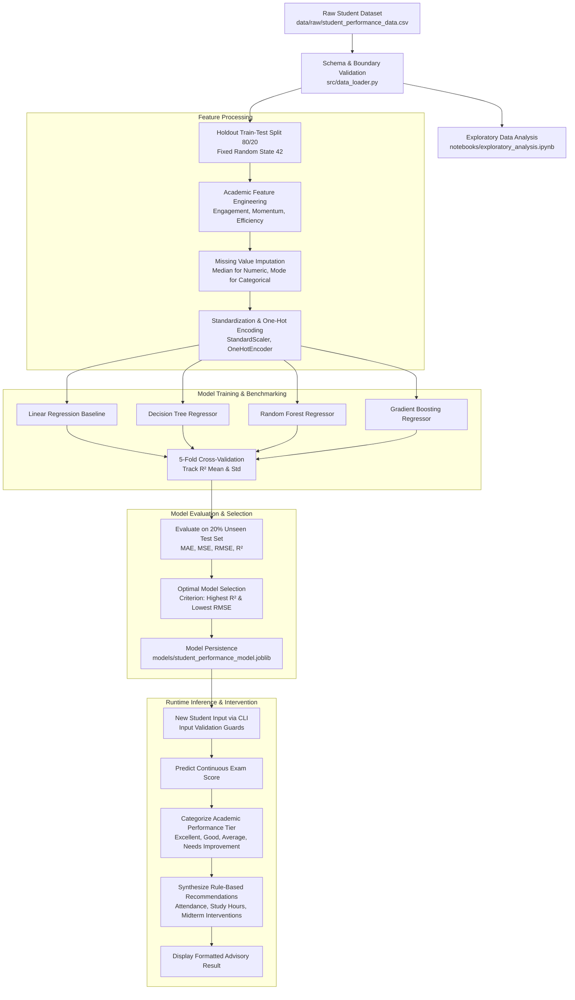

# Machine Learning Workflow Documentation

## 1. End-to-End Workflow Process
The system follows a rigorous supervised machine learning lifecycle from raw tabular data ingestion to holdout evaluation and real-time advisory delivery.

---

## 2. Workflow Diagram (Mermaid)

